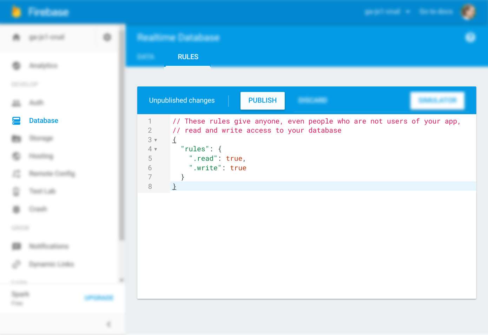

# Setup Firebase App

Go to Firebase's homepage:

**[firebase.google.com](https://firebase.google.com)**

Click _Go to console_ in top-right.

_Note: Be sure to disable ad blockers or the following steps may not work._


Copy the config you're shown into `app.js`.

---

## Data Access

By default, Firebase makes your database access private. For the demo purposes
here today, we want to make the database public.

_Note: You should never do this in a real world app. Instead, you should [set up
authentication based
access](https://firebase.google.com/docs/database/security/)._

When viewing your project, select _Database > Rules >_ [Paste the below code] _>
Publish_

```javascript
// These rules give anyone, even people who are not users of your app,
// read and write access to your database
{
  "rules": {
    ".read": true,
    ".write": true
  }
}
```



---

Once done, move on to [step 02 - Create](02.md).
