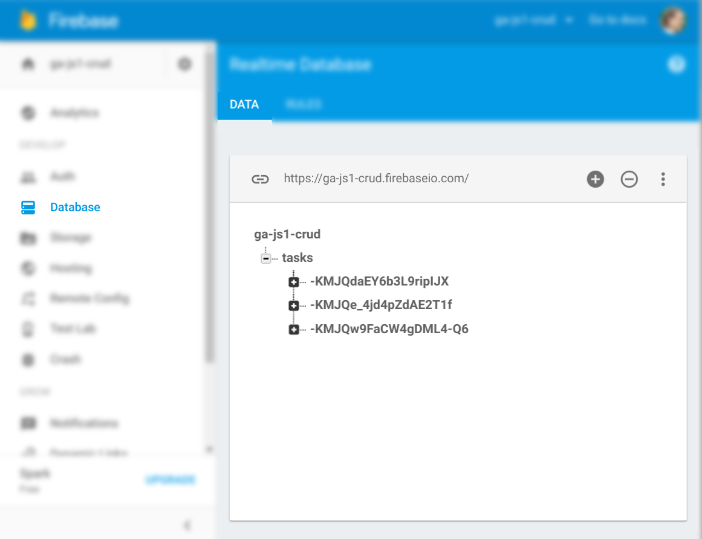

# Create data

As your app grows, you are going to need to manage more and more data. Making
some wise early desicions can be key in making this as painless as possible.

Before continuing, read up on how to [Structure Your
Database](https://firebase.google.com/docs/database/web/structure-data).

---

You can create data in Firebase in 2 ways:

1. In the _Console_ at [firebase.google.com](https://firebase.google.com)
   (_Database > DATA >_ [Edit the JSON structure])
2. Via your app's JavaScript.

## Creating Data in JS

```javascript
firebase.database().ref('tasks/').push({
  title: 'Learn CRUD',
  done: true
});
```

Executing `.push()` will add a new item to the `tasks` collection with the given
`title` and `done` values.

Notice that `tasks/` has a trailing slash. This isn't strictly necessary, but
helps to demonstrate that you are accessing data by a _path_ into the JSON
database.

That is; Instead of using a `.` like when accessing a key in a JS object, you use
a `/` to access a key in a Firebase database.

If you run the above code multiple times, then visit the _Database_ section of
the Console on Firebase, you will see multiple entries have been added for you.

You'll also note that the `tasks` collection was automatically added too.

When _pushing_ to a collection, Firebase will automatically generate a unique id for
you such as `-KMJQdaEY6b3L9ripIJX`.



---

```javascript
firebase.database().ref('tasks/').set({
  abc123: {
    title: 'Overwrite data',
    done: true
  }
});
```

Using `.set()` will _overwrite all values at the given path `tasks`_ with the
object you pass it.

This is useful for completely resetting data, but can also be useful for
explicitly creating data with your own keys:

```javascript
firebase.database().ref('tasks/xyz890/').set({
  title: 'Set new data',
  done: true
});
```

If you view the database in the console now, you will see a new object has been
created with the key `xyz890`.

---

Once done, move on to [step 03 - Read](03.md).
