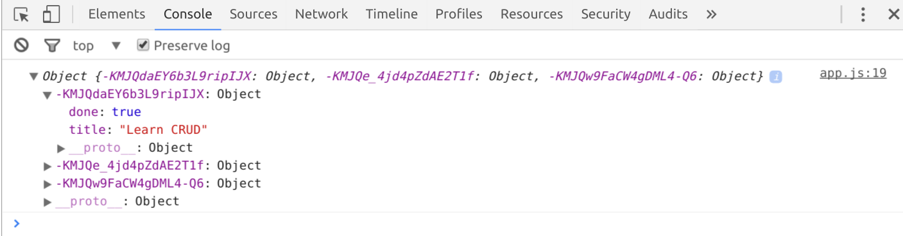

# Read data

## Reading Data in JS

```javascript
firebase.database().ref('tasks/').once('value').then(function(snapshot) {
  console.log(snapshot.val());
});

// --- or ---

firebase.database().ref('tasks/').on('value', function(snapshot) {
  console.log(snapshot.val());
});
```

The first example uses `.once()`, and will get the data for the `tasks` key once
using a Promise. This is useful for setting up your application with data that
wont be changed from anywhere else.

The second example uses `.on()`, and will also get the data for `tasks`. It will
then continue to execute the callback whenever there is a change to the data
from anywhere (eg; in the console). _Note: `.on()` does **not** return a
Promise_.

Try out the second example; Load up the page, then go and edit the data in your
app's Console. You should see the new data outputted in the console of your page
along side the existing data.



Once done, move on to [step 04 - Update](04.md).
